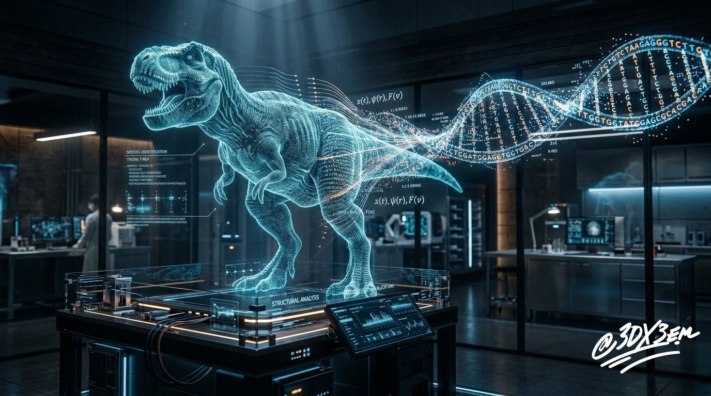

# PROJECT-CHRONOS
PROJECT CHRONOS: The Reverse Morphology Pipeline

### Executive Summary

Traditional synthetic biology and evolutionary research models rely heavily on forward-directed iteration: applying manual genetic edits to modern model organisms and screening for downstream physical traits. This forward approach represents an inefficient, combinatorial search space that demands substantial wet-lab expenditure while producing low-fidelity structural alignment.

We introduce a computational paradigm shift: an inverse generative architecture. By training high-dimensional structural models on comprehensive legacy and extant morphological data, our platform reconstructs the latent functional blueprints required to produce targeted physical geometries. Rather than relying on sparse preservation or stochastic mutagenesis, our platform treats biological design as an inverse reconstruction problem, significantly reducing R and D cycle times while optimizing commercial biomanufacturing and structural restoration pathways.

### Redacted Technical Appendix

The computational pipeline bypasses traditional iterative screening by deploying a generative structural platform that maps multi-dimensional phenotypic physical structures back to candidate functional sequences. 
